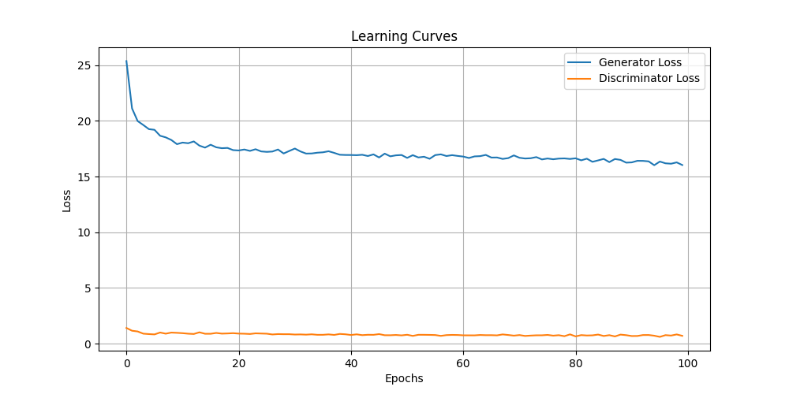

# AutoGanCartoon
## prerequis
### Installation
1. clone the repo
```bash
git clone https://github.com/gyxcit/AutoGanCartoon.git
```
2. create and activate a venv (on windows)
```bash
#create the env
python -m venv venv

#activate
.\venv\Script\activate
```

3. install requirements
```bash
pip install -r requirement.txt
```

### Test 
if you want to test directly, you can use the pretrain version we setup in the file  **test_model.py**

---
## Informations
### Image cardboarding project 
1. The first step in the project was to create an algorithm that would enable us to cartoonize the images using computer vision techniques. This algorithm can be found in the file ***`cartoonization.py`*** which enabled us to cartoonize our images and create the knowledge base for training the model.

2. For the second step, which consisted in creating a GAN (generative adversarial network) model of Pix2Pix, we trained our model in the ***`trainingGan.ipynb`*** file, where we can see how the model was created and trained. The learning curves over the epoch.<br>
    
    **Note:**
    - we splitted our dataset directly in the training with a function of scikit-leanr so we don't have to create another folder for train and test. 
    - As we didn't have a gpu at our disposal, we used google colab, which gave us access to powerful GPUs.

3. Finally, the ***`test_models.py`*** file contain code for you to test the cartoonization effect on your own for:
    - image
    - video

examples:
---
| normal             | cartoon            |
|-----------------------|----------------------|
|  |  |

--- 
The video generated is `cartoon _video.mp4` , but it doesn't open in vscode, it has to be opened with a video player, so we made a video capture to show the result. 
the video capture file is called: `opt_cars.mp4`

**Note:** 
- For the video, once the transformation has been made, the video will be generated but will not be able to open directly on vscode; it will have to be opened with a video player.
- The results of the tests we've carried out can be found in the result_gen folder, but your results will be generated in the current project folder.